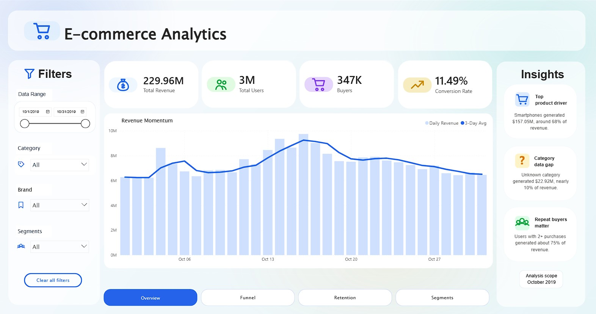
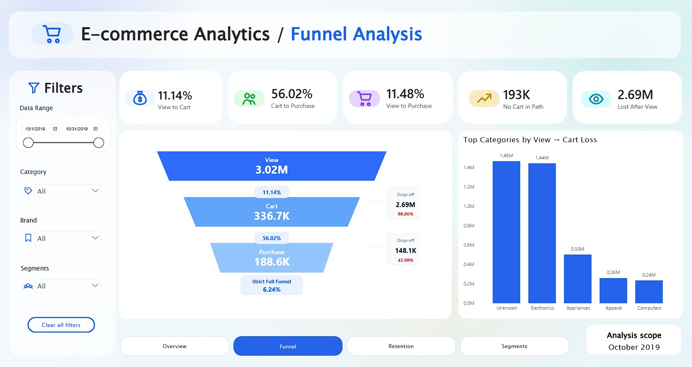
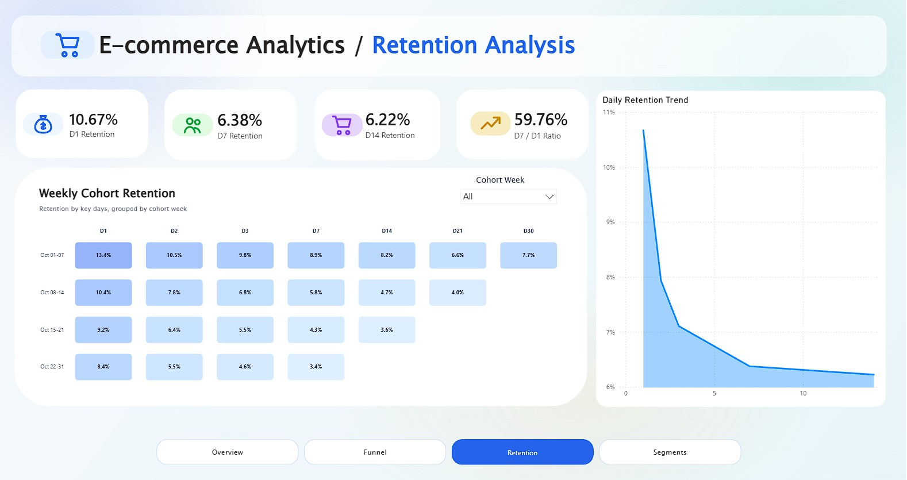
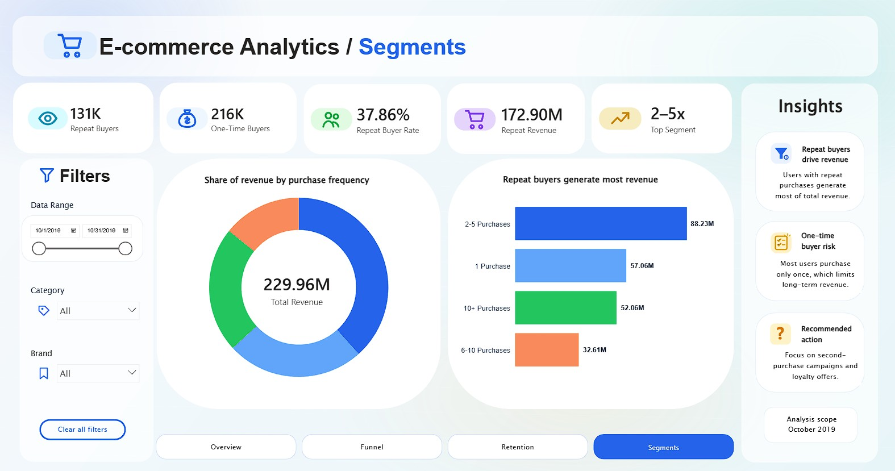

# E-Commerce Analytics Dashboard

## Project Overview

This project analyzes October 2019 user behavior and revenue performance for a multi-category e-commerce store. The goal is to turn raw event-level data into a business-ready Power BI dashboard supported by PostgreSQL transformations.

The analysis focuses on four areas:

* Executive revenue and user performance
* Sequential purchase funnel behavior
* User retention by acquisition cohort
* Purchase-frequency customer segmentation

## Live Dashboard

[Open the interactive Power BI dashboard](https://app.powerbi.com/view?r=eyJrIjoiZjE2ZWI1NmEtMDIyYS00YTJlLTk1NjAtZGM4NTI1YTYyNTU2IiwidCI6IjUwOTlmMzI1LWRmYzYtNGJmZS05Y2IzLTgwMDZlYjE4NzM3NiJ9&pageName=791c3245f8f7e176c7d5)

## Dashboard Preview

### Executive Overview



### Funnel Analysis



### Retention Analysis



### Segments



## Dataset

Source: [Ecommerce behavior data from multi category store](https://www.kaggle.com/datasets/mkechinov/ecommerce-behavior-data-from-multi-category-store/data)

This project uses the October 2019 event file. Each row is one user event.

| Column | Description |
| --- | --- |
| `event_time` | Event timestamp |
| `event_type` | Event type: `view`, `cart`, `purchase` |
| `product_id` | Product identifier |
| `category_id` | Product category identifier |
| `category_code` | Product category path |
| `brand` | Product brand |
| `price` | Event price |
| `user_id` | User identifier |
| `user_session` | Session identifier |

## Tools

* PostgreSQL
* Power BI
* DAX
* Deneb custom visuals

## Dashboard Pages

### Executive Overview

High-level performance view with total revenue, total users, buyers, conversion rate, revenue momentum, category filters, brand filters, and key business insights.

### Funnel Analysis

Sequential user-level funnel from product view to cart to purchase. The page highlights the largest drop-off point and separates strict funnel conversion from the cart tracking gap.

### Retention Analysis

Weekly cohort retention with key retention days and a retention decay chart. The analysis uses eligible cohorts only, so later October cohorts are not compared on retention days that cannot be observed inside the dataset window.

### Segments

Purchase-frequency segmentation comparing one-time buyers and repeat buyers. The page shows repeat buyer contribution, revenue share by purchase frequency, top revenue segment, category hierarchy filtering, and brand filtering.

## Key Metrics

| Metric | Value |
| --- | ---: |
| Total revenue | 229.96M |
| Total users | 3.02M |
| Purchase users | 347K |
| View-to-purchase conversion | 11.49% |
| View-to-cart conversion | 11.14% |
| Cart-to-purchase conversion | 56.02% |
| D1 retention | 10.67% |
| D7 retention | 6.38% |
| D14 retention | 6.22% |
| Repeat buyer rate | 37.86% |
| Repeat revenue | 172.90M |

## Key Insights

* Product views dominate event activity, while only about 11% of viewing users add products to cart.
* The main funnel issue is the view-to-cart step.
* A large number of purchasing users have no recorded cart event, which indicates either direct checkout behavior or incomplete cart tracking.
* Retention is strongest in the first few days after the initial visit and declines quickly after D1.
* Repeat buyers generate most of total revenue despite one-time buyers being the largest customer group.
* The `2-5 Purchases` segment is the strongest revenue segment.
* Missing category values are kept as `Unknown` because they materially contribute to revenue.

## SQL Workflow

Run the scripts in order:

| Script | Purpose |
| --- | --- |
| `00_create_table.sql` | Creates the raw event table and base indexes |
| `01_data_overview.sql` | Event, revenue, user, weekday, and category overview |
| `02_funnel_analysis.sql` | Sequential funnel and cart tracking gap checks |
| `03_retention_analysis.sql` | Cohort retention base table |
| `04_user_segmentation.sql` | Purchase-frequency user segmentation |
| `05_data_quality_checks.sql` | Missing category and price checks |
| `06_dashboard_support_tables.sql` | Core Power BI support tables |
| `07_funnel_filter_support.sql` | Filter-ready funnel table by user/category/brand path |
| `08_retention_dashboard_support.sql` | Weekly and daily retention tables for Power BI |
| `09_segments.sql` | Filter-ready segment purchase table |

## Project Structure

```text
ecommerce-analytics-dashboard/
|-- dashboard/
|   |-- assets/
|   |   |-- icons/
|   |   |-- light_premium_gradient.png
|
|-- screenshots/
|
|-- sql/
|   |-- 00_create_table.sql
|   |-- 01_data_overview.sql
|   |-- 02_funnel_analysis.sql
|   |-- 03_retention_analysis.sql
|   |-- 04_user_segmentation.sql
|   |-- 05_data_quality_checks.sql
|   |-- 06_dashboard_support_tables.sql
|   |-- 07_funnel_filter_support.sql
|   |-- 08_retention_dashboard_support.sql
|   |-- 09_segments.sql
|
|-- .gitignore
|-- README.md
```

Power BI `.pbix` files and raw CSV exports are not tracked in this public repository.

## How to Reproduce

1. Download the October 2019 dataset from Kaggle.
2. Load the CSV into PostgreSQL table `ecommerce_events`.
3. Run SQL scripts from `sql/` in numeric order.
4. Refresh the Power BI model.
5. Connect visuals to the prepared dashboard support tables.

## Author

Created as a data analytics and business intelligence portfolio project.
